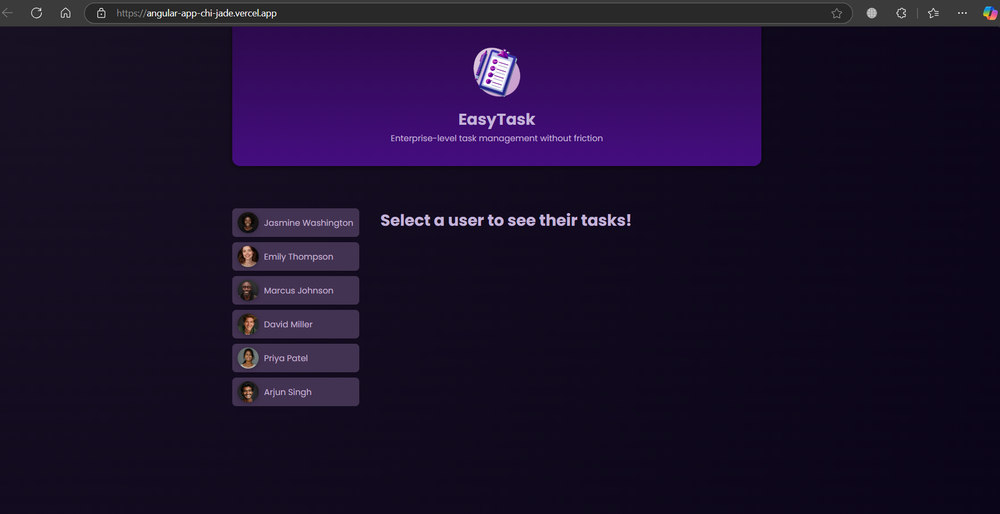
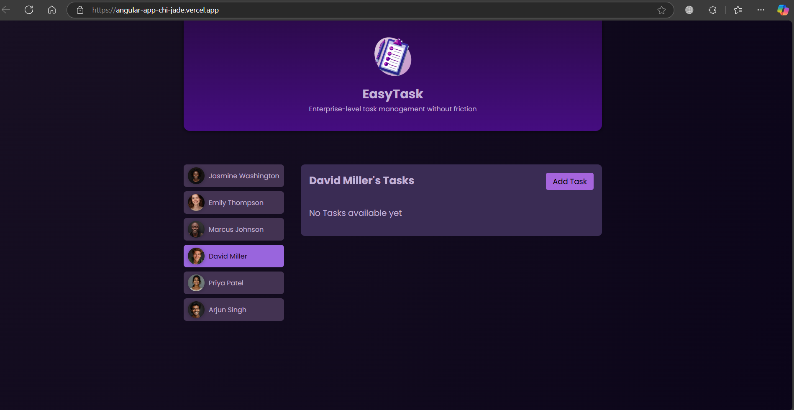

# EasyTask Management


## 🚀 About the Project

**EasyTask Management** is a simple Angular application designed to manage tasks effectively. It allows you to view available users, assign tasks to users, and manage task statuses without the complexity of authentication or advanced features.

### Key Features

- 📝 **Task Assignment**: Assign tasks to users from a list of available users.
- 📋 **Task Management**: View, edit, and delete tasks with ease.
- ✅ **Task Completion**: Mark tasks as completed with a single click.
- 🖥️ **Frontend Only**: This is a frontend-only application built with Angular.

---

## 🛠️ Tech Stack

### Frontend:
- **Angular** (Latest Version) 
- **HTML5** 
- **CSS3** 
- **TypeScript** 

---

## ⚙️ Installation and Setup

Follow these steps to get the project up and running on your local machine:

### Prerequisites:
- Node.js and npm installed

### Clone the Repository:
```bash
$ git clone https://github.com/Aimerick-Noua/EasyTask-Management.git
$ cd EasyTask-Management
```

### Setup:
1. Navigate to the project folder:
   ```bash
   $ cd frontend
   ```
2. Install dependencies:
   ```bash
   $ npm install
   ```
3. Run the Angular application:
   ```bash
   $ ng serve
   ```

---

## 🎨 Screenshots

### 1. User List View


### 2. Task Assignment Interface


### 3. Task Completion Interface


---

## 🤝 Contributing

Contributions are welcome! Please follow these steps:

1. Fork the repository.
2. Create a feature branch: `git checkout -b feature-name`.
3. Commit your changes: `git commit -m 'Add some feature'`.
4. Push to the branch: `git push origin feature-name`.
5. Open a pull request.

---

## 📝 License

This project is licensed under the MIT License - see the [LICENSE](LICENSE) file for details.

---

## 🌟 Support

If you like this project, please give it a ⭐️ and share it with others!

---

## 📧 Contact

For questions or suggestions, feel free to reach out:
- **GitHub**: [Aimerick-Noua](https://github.com/Aimerick-Noua)

---
